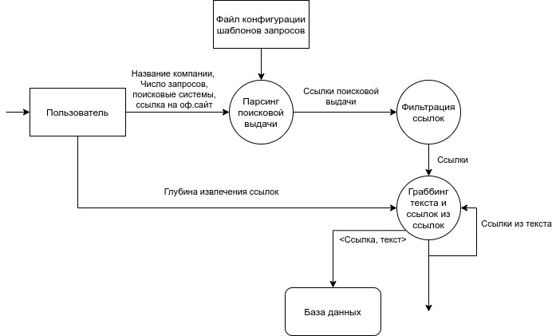

# Web Crawler
## Chain of operation
***

### *Data flow diagram*

### How to install
## ``Linux``

* ``python3 -m venv venv``

* `` . ./venv/bin/activate``

* `` pip install -r requirements.txt ``

* `` pyppeteer-install ``

* ``docker-compose build``

* ``docker-compose up -d``
 

 
* ``sudo apt install tor``

 
* Generate the tor password in the console  `` --hash-password mypassword ``

 
* Copy mypassword to buffer

 
* `` sudo nano /etc/tor/torrc ``

 
* Save the password to our ``torrc file`` in a line that starts with ``HashedControlPassword``

 
* Uncomment the line starting with ``HashedControlPassword``

* Uncomment the line starting with ``ControlPort 9051``

* Let's save the changes.